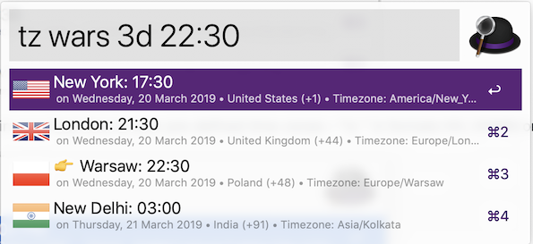

# TimeZone-Alfred

Do you like [Alfred](https://www.alfredapp.com/)? I like too… I’ve recently found bunch of very nice Workflows. For me, the most used one is for sure Time Zone.

The workflow has been created by Mr Carlos from New Zealand and published on the [Alfred Forum](http://www.alfredforum.com/topic/491-timezones-a-world-clock-script-filter-updated-to-v17/). I’ve enhanced the workflow by adding a few new functionalities:

* Converting any time to all pre-defined time zones
* Enabling 24-hrs time format
* Displaying phone country code

After all it looks like below:

Conversion of a time in your local time to your pre-defined time-zones – “tz <time>” in formats HH, HHMM or HH:MM:

Conversion of a time in a timezone from your list (Warsaw in the sample) with modified date (plus 3 days in the sample):

## Commands

* **Keyword**: *tz* (or hotkey) - bring up the list of saved cities with their respective current times. (Keep typing the name of a place for a one-off lookup.)
* **Keyword**: *tz [part of city name]* - searches for a city in your cities that matches that name and shows the current time.
* **Keyword**: *tz [`time`]* - (where `time` is HH, HHMM or HH:MM) - convert provided time into the time of your cities.
* **Keyword**: *tz [`date`] [`time`]* - (where `time` is as above and `date` is 'today' (short: 't'), or 'tomorrow' (short: 'tm'), or [number of days]d what means to add the number of days to current date, or one of dd, mmdd, yymmdd, yyyymmdd to give an absolute date) - convert provided date and time into time of your cities.
* **Keyword**: *tz [`source city`] [`date`] [`time`]* - (where `time` and `date` are as above and `source city` is used to search in your city list) - assumes that date and time is given in the timezone of provided source city and converts it into time of your (other) cities.
* **Keyword**: *timezone add [your city]* - add your city to the list. (To remove a city, option-select it from the main list.)
* **Keyword**: *timezone edit* - open for edit of cities file.
* **Keyword**: *timezone move* - move the saved cities file (timezones.txt) to a location of your choice (so you can sync it in your Dropbox or whatever you want).
* **Keyword**: *timezone 12h*, *timezone 24h* - change format of displayed time.

## Keyboard shortcuts

* *Option + Enter* - remove from the list
* *Command + Enter* - pin/unpin the city from the top of the list.

## Installation steps

1. Install Alfred
2. Purchase premium version of Alfred to enable Workflows
3. Download latest ZIP file from [releases](https://github.com/jaroslawhartman/TimeZones-Alfred/releases)
4. Unzip and double click to add to Alfred

## References

* GeoIP2 City and Country CSV Databases: https://dev.maxmind.com/geoip/geoip2/geoip2-city-country-csv-databases/
* Flag icons from: http://www.free-country-flags.com (Creative Commons Attribution-ShareAlike 3.0 Unported License.)
* Icon design by Logo Open Stock (modified from original) http://www.logoopenstock.com
